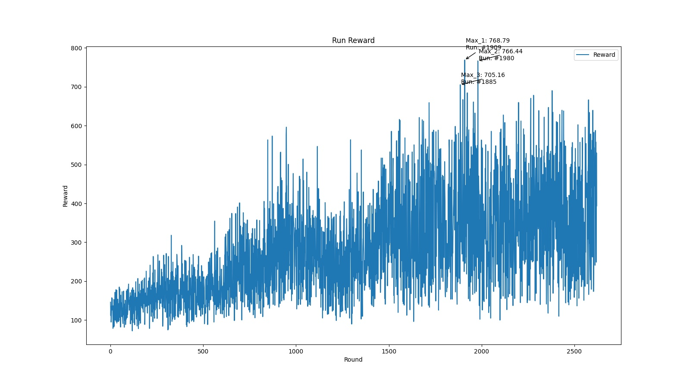
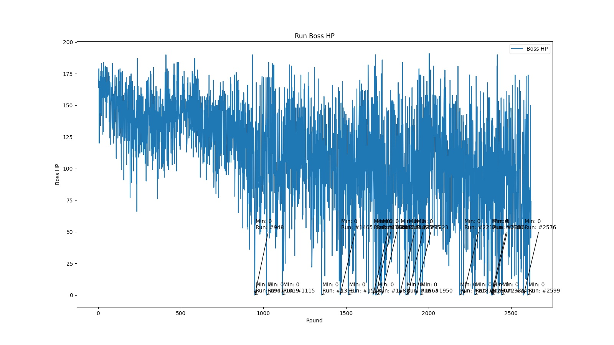
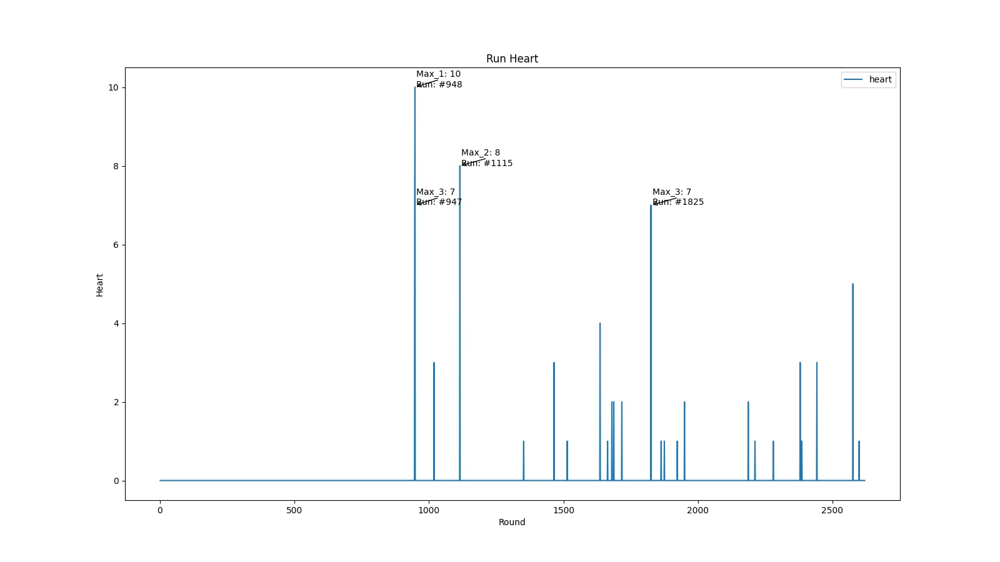

<!--
 * @Description: 
 * @Author: shadow221213
 * @Date: 2023-10-06 17:21:27
 * @LastEditTime: 2023-10-06 21:28:17
-->
# 
基于SerpentAI的《*Binding of Isaac*》

    <a href="https://github.com/shadow221213/SerpentAI-based-for-Binding-of-Isaac/blob/master/README.md">
        English
    </a> 
    | 
    <a href="https://github.com/shadow221213/SerpentAI-based-for-Binding-of-Isaac/blob/master/Chinese.md">
        简体中文
    </a>

偶然间看见[SerpentAI](https://github.com/SerpentAI/SerpentAI)中有一张《*Binding of Isaac*》的演示图，决心一试。

感谢[Serpent.AI](https://www.youtube.com/@SerpentAI)的直播录像让我有学习使用的途径。

## 结果如下：

激励图：

存活时间图：

boss剩余的血量图：

Isaac剩余的血量图：

最后尝试的结果虽然能看出模型在往好的方向发展，但是实际操作略显笨拙，甚至有些躺平的意味，但看到没有人发过，决定将这次尝试的结果发出来以供参考。