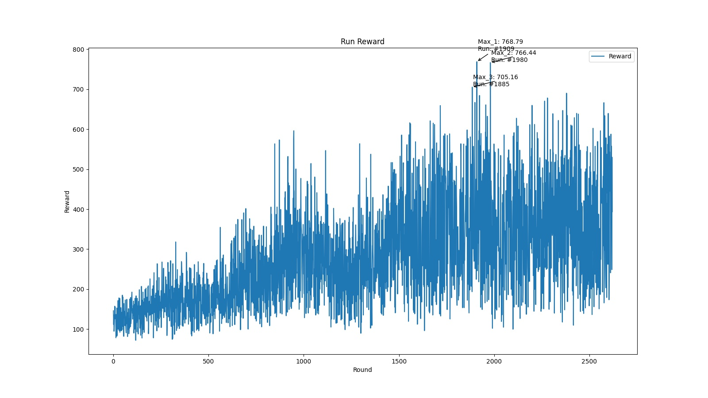
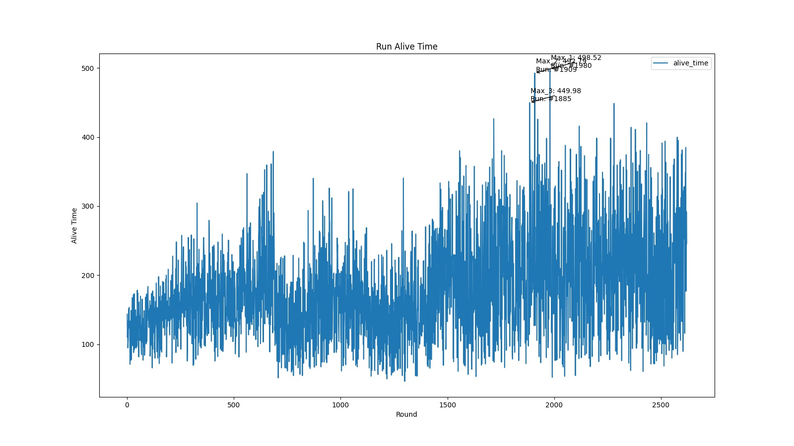
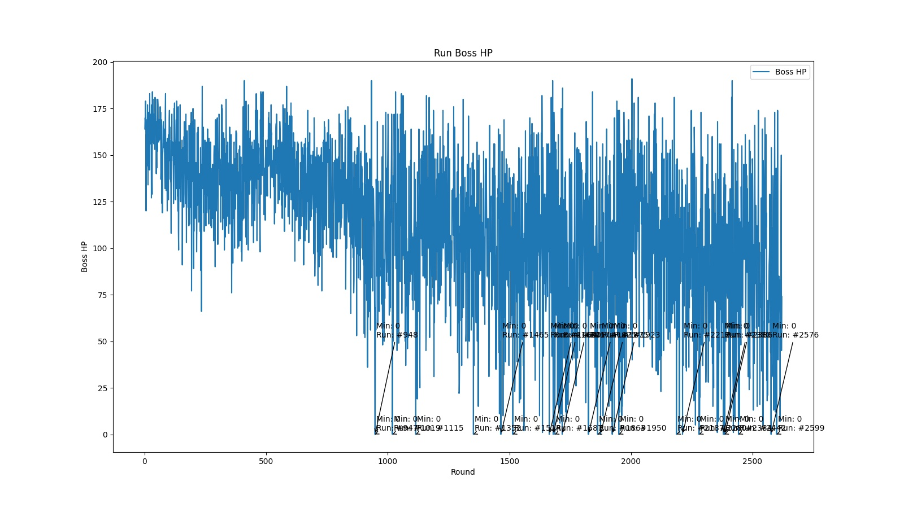
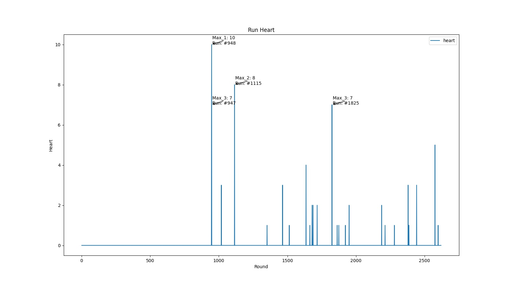

<!--
 * @Description: 
 * @Author: shadow221213
 * @Date: 2023-10-06 17:14:05
 * @LastEditTime: 2023-10-06 21:34:03
-->
# 
SerpentAI-based for *'Binding of Isaac: Repentance'*

    <a href="https://github.com/shadow221213/SerpentAI-based-for-Binding-of-Isaac/blob/master/README.md">
        English
    </a> 
    | 
    <a href="https://github.com/shadow221213/SerpentAI-based-for-Binding-of-Isaac/blob/master/Chinese.md">
        简体中文
    </a>

I happened to see a demo img of *'Binding of Isaac: Repentance'* in [SerpentAI](https://github.com/SerpentAI/SerpentAI) and resolved to give it a try.

Thanks to [Serpent.AI](https://www.youtube.com/@SerpentAI)'s live video for giving me a way to learn how to use it.

## The results are shown below:

Reward Chart:

Alive Time Chart:

Boss Hp Chart:

Isaac Heart Chart:

The results of the final try, while you can see that the model is moving in a good direction, are slightly clumsy in practice, and even a bit of a lying flat, but seeing that no one has uploaded them before, I decided to post the results of this try for reference.